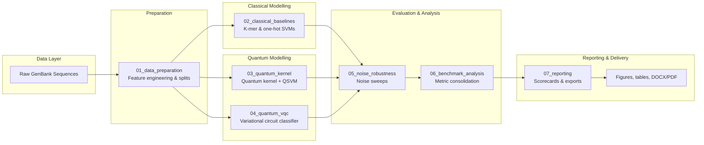

# qml-dna: Quantum Machine Learning for DNA Sequence Classification


A comprehensive hybrid quantum-classical research pipeline for supervised DNA sequence classification. This project combines reproducible feature engineering, strong classical machine learning baselines, and experimental quantum machine learning (QML) models to benchmark how quantum circuits compare to optimised support vector machines on genomics tasks.

## Table of Contents

- [Overview](#overview)
- [Key Features](#key-features)
- [System Architecture](#system-architecture)
- [Project Layout](#project-layout)
- [Notebook Workflow](#notebook-workflow)
- [Getting Started](#getting-started)
- [Running the Pipeline](#running-the-pipeline)
- [Automation & Batch Execution](#automation--batch-execution)
- [Generated Artefacts](#generated-artefacts)
- [Reproducibility & Quality](#reproducibility--quality)
- [Technology Stack](#technology-stack)
- [Contributing](#contributing)
- [Troubleshooting](#troubleshooting)
- [License](#license)

## Overview

This project implements a production-grade machine learning pipeline that bridges classical and quantum computing for genomic sequence analysis. It serves as both a research framework and a practical tool for exploring quantum advantage in domain-specific machine learning tasks.

**Core capabilities:**

- **End-to-end research workflow:** Parses raw GenBank data, engineers sequence features, trains classical and quantum classifiers, and assembles publication-ready reports.
- **Comprehensive benchmarking:** Compares k-mer and one-hot SVMs against quantum kernel methods and variational quantum circuits, including detailed noise sensitivity sweeps.
- **Reproducible design:** Notebook-driven architecture with cached intermediate artefacts enables independent recomputation of downstream stages and cross-experiment reuse.
- **Publication-ready outputs:** Generates richly formatted DOCX/PDF reports with calibration diagnostics, radar plots, ROC/PR curves, confusion matrices, and comprehensive reproducibility appendices.

## Key Features

- **Multi-modal feature engineering** – k-mer representations, one-hot encoding, and quantum feature maps
- **Classical baselines** – SVM classifiers with automatic hyperparameter tuning via grid search
- **Quantum algorithms** – Quantum kernel methods (QSVM) and variational quantum circuits (VQC) via PennyLane/Qiskit
- **Noise robustness analysis** – Systematic sweeps across depolarizing, amplitude damping, and phase damping channels
- **Comprehensive metrics** – AUC/ROC, F1, precision, recall, calibration curves, and probability diagnostics
- **Provenance tracking** – JSON-based RunJournal logging for full audit trails
- **Batch automation** – Papermill integration for scheduled or CI/CD-driven regeneration

## System Architecture



### Key Responsibilities

- **Preparation** builds feature matrices, train/validation/test splits, and metadata needed by all models.
- **Classical branch** delivers competitive baselines using scikit-learn SVMs with hyperparameter searches.
- **Quantum branch** explores QSVMs via cached Gram matrices and parameterised variational circuits optimised through PennyLane/Qiskit.
- **Evaluation** aggregates metrics, calibration data, and probability outputs to compare classical vs quantum regimes under multiple noise models.
- **Reporting** curates results into shareable scorecards, figures, and reproducibility bundles.

## Project Layout

```text
qml-dna/
├── data/
│   ├── raw/                    # External GenBank inputs (not tracked)
│   │   ├── *.gb                # GenBank sequence files
│   │   └── *.fasta             # FASTA format sequences (optional)
│   └── processed/              # Engineered features, splits, cached matrices
│       ├── dataset_index.csv   # Sequence metadata and indices
│       ├── labels.csv          # Classification labels per sequence
│       ├── encodings_all.npz   # Pre-computed feature matrices
│       ├── splits_pooled.json  # Train/val/test split manifest
│       └── *_features.csv      # Per-sequence feature matrices
├── results/
│   ├── metrics/                # CSV metrics, scorecards, per-model KPIs
│   ├── figures/                # Publication-ready ROC/PR curves, heatmaps, calibration plots
│   ├── tables/                 # LaTeX/CSV formatted tables for reports
│   ├── report/                 # Final DOCX/PDF deliverables + assets
│   ├── logs/                   # RunJournal JSON + markdown execution logs
│   ├── kernels/                # Cached Gram matrices and anchor indices
│   ├── cache/                  # Intermediate PCA, scaler, kernel cache
│   └── cm_cache/               # Confusion matrix + probability outputs
├── 01_data_preparation.ipynb   # GenBank parsing, feature engineering, splits
├── 02_classical_baselines.ipynb # SVM classifiers + hyperparameter tuning
├── 03_quantum_kernel.ipynb     # Quantum feature maps + Gram matrix computation
├── 04_quantum_vqc.ipynb        # Variational circuit training + evaluation
├── 05_noise_robustness.ipynb   # Noise sweeps across all model variants
├── 06_benchmark_analysis.ipynb # Metric consolidation + KPI computation
├── 07_reporting.ipynb          # Report generation + figure/table export
├── environment.yml             # Conda environment specification
├── requirements.txt            # Minimal pip requirements (alternative)
├── LICENSE                     # MIT License
└── README.md                   # This file
```

## Notebook Workflow

| Notebook | Purpose | Key outputs |
| --- | --- | --- |
| `01_data_preparation.ipynb` | Parse raw sequences, compute k-mer/one-hot features, stratify splits, and capture dataset metadata. | `data/processed/`, `results/logs/` |
| `02_classical_baselines.ipynb` | Train and evaluate SVM baselines with grid searches and calibration. | `results/metrics/svm_*`, ROC/PR caches |
| `03_quantum_kernel.ipynb` | Build quantum feature maps, cache Gram matrices, and train QSVMs via PennyLane Lightning. | `results/kernels/`, `results/metrics/qsvm_*` |
| `04_quantum_vqc.ipynb` | Optimise variational quantum circuits and export learned parameters plus evaluation metrics. | `results/vqc_weights.npy`, `results/metrics/vqc_metrics.csv` |
| `05_noise_robustness.ipynb` | Sweep device noise models across classical vs quantum variants to assess robustness. | `results/metrics/noise_sweep_*.csv`, heatmaps |
| `06_benchmark_analysis.ipynb` | Consolidate metrics, align labels, compute composite KPIs, and prep caches for reporting. | `results/metrics/combined.csv`, ROC/PR caches |
| `07_reporting.ipynb` | Generate scorecards, calibration plots, summaries, and DOCX/PDF reports for stakeholders. | `results/report/`, `results/figures/`, `results/tables/` |

## Getting Started

2. Create the project environment:

   ```bash

   conda activate qml-dna
   python -m ipykernel install --user --name qml-dna
   ```

4. Keep dependencies in sync after updates:

   ```bash
   conda env update -f environment.yml --prune
   ```

5. If you prefer pip-only installs, `pip install -r requirements.txt` covers the light-weight stack (quantum extras still require compatible system libraries).

## Running the Pipeline

- To refresh results from a specific stage, delete its downstream artefacts (if needed) and rerun just that notebook; cached intermediate files ensure reproducibility.
- For report regeneration:

  ```bash
  conda activate qml-dna
  jupyter lab
  # Open 07_reporting.ipynb and run all cells
  ```

  The report notebook emits `results/report/DNA_QML_Results_Report.docx` and `.pdf`, plus updated figure/table exports.

## Automation & Batch Execution

- Combine with task schedulers or CI to rebuild artefacts nightly; each notebook respects existing caches so repeated executions are cheap.

- Parameterise `papermill` executions to swap datasets, feature configurations, or noise scenarios without editing the source notebooks.

## Generated Artefacts

- `data/processed/` stores engineered feature matrices, labels, and split manifests.
- `results/metrics/` captures per-model metrics, combined scorecards, noise sweep summaries, and probability diagnostics.
- `results/figures/` holds ROC/PR curves, confusion matrices, calibration overlays, radar plots, and noise heatmaps ready for publication.
- `results/tables/` provides CSV and LaTeX tables that flow directly into the reporting notebook.
- `results/logs/` archives RunJournal JSON logs for debugging large sweeps.
- `results/report/` contains the final DOCX/PDF deliverables and their supporting assets.
- `results/appendix/` bundles environment manifests, dependency snapshots, and provenance data for compliance.

## Reproducibility & Quality

- Export the active environment for archival with `conda env export --from-history > env.lock.yml`.

- Run `pytest` to validate helper scripts before regenerating reports or running large sweeps.

- Enable calibration diagnostics and probability audits via the reporting notebook to detect drift.

## Technology Stack

**Core Scientific Stack:**

- [NumPy](https://numpy.org/) – Numerical computing
- [Pandas](https://pandas.pydata.org/) – Data manipulation and analysis
- [Scikit-learn](https://scikit-learn.org/) – Classical machine learning (SVM implementations)
- [SciPy](https://scipy.org/) / [Statsmodels](https://www.statsmodels.org/) – Statistical analysis

**Quantum Computing:**

- [PennyLane](https://pennylane.ai/) – Differentiable quantum computing framework
- [PennyLane-Lightning](https://pennylane.ai/) – High-performance simulator backend
- [Qiskit](https://qiskit.org/) – IBM quantum computing framework

**Visualization & Reporting:**

- [Matplotlib](https://matplotlib.org/) / [Seaborn](https://seaborn.pydata.org/) – Static plotting
- [Plotly](https://plotly.com/) – Interactive visualizations
- [python-docx](https://python-docx.readthedocs.io/) / [ReportLab](https://www.reportlab.com/) – Document generation

**Bioinformatics:**

- [BioPython](https://biopython.org/) – Sequence parsing and analysis

**Development & Automation:**

- [Jupyter Lab/Notebook](https://jupyter.org/) – Interactive development
- [Papermill](https://github.com/nteract/papermill) – Notebook parameterization & execution
- [Black](https://black.readthedocs.io/) / [Ruff](https://github.com/astral-sh/ruff) – Code formatting & linting

## Contributing

Contributions, bug reports, and feature requests are welcome! Please follow these steps:

1. Fork the repository
2. Create a feature branch (`git checkout -b feature/my-feature`)
3. Commit your changes with clear messages
4. Push to the branch
5. Open a pull request

Please ensure your code follows the project's style guidelines (Black/Ruff) and that all notebooks execute without errors before submission.

## Troubleshooting

- **Quantum backend issues:** Ensure `pennylane-lightning` and `qiskit` match the versions in `environment.yml`; reinstall the environment if CUDA/OpenMP libraries have changed.
- **Report export errors:** Confirm `python-docx` and `reportlab` are present, then remove `results/report/` before re-running `07_reporting.ipynb` to regenerate clean outputs.
- **Large notebook runs:** Use `papermill` or Jupyter's `Run -> Select Below` to resume from checkpoints without reprocessing earlier cells.

## License

Distributed under the terms of the [MIT License](LICENSE).

---

**Repository:** [DATDSG/qml-dna](https://github.com/DATDSG/qml-dna)  
**Maintainers:** DATDSG Team  
**Last Updated:** November 2025
