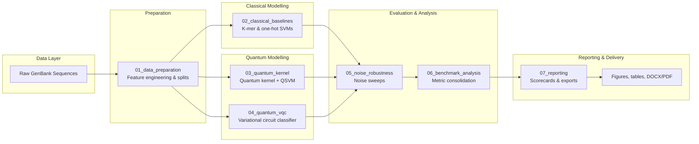

# qml-dna

Hybrid quantum-classical pipeline for supervised DNA sequence classification. The project combines reproducible feature engineering, strong classical baselines, and experimental quantum machine learning (QML) models to benchmark how quantum circuits compare to optimised support vector machines on genomics tasks.

## Table of Contents
- [Overview](#overview)
- [System Architecture](#system-architecture)
- [Project Layout](#project-layout)
- [Notebook Workflow](#notebook-workflow)
- [Getting Started](#getting-started)
- [Running the Pipeline](#running-the-pipeline)
- [Automation & Batch Execution](#automation--batch-execution)
- [Generated Artefacts](#generated-artefacts)
- [Reproducibility & Quality](#reproducibility--quality)
- [Troubleshooting](#troubleshooting)
- [License](#license)

## Overview
- End-to-end research workflow: parses raw GenBank data, engineers sequence features, trains classical and quantum classifiers, and assembles publication-ready reports.
- Benchmarks k-mer and one-hot SVMs against quantum kernel methods and variational quantum circuits, including detailed noise sensitivity sweeps.
- Notebook-driven design with cached intermediate artefacts so downstream stages can be recomputed independently or re-used across experiments.
- Rich reporting outputs (DOCX/PDF, calibration diagnostics, radar plots) and reproducibility appendices for audit trails.

## System Architecture


**Key responsibilities**
- **Preparation** builds feature matrices, train/validation/test splits, and metadata needed by all models.
- **Classical branch** delivers competitive baselines using scikit-learn SVMs with hyperparameter searches.
- **Quantum branch** explores QSVMs via cached Gram matrices and parameterised variational circuits optimised through PennyLane/Qiskit.
- **Evaluation** aggregates metrics, calibration data, and probability outputs to compare classical vs quantum regimes under multiple noise models.
- **Reporting** curates results into shareable scorecards, figures, and reproducibility bundles.

## Project Layout
```text
qml-dna/
|-- data/
|   |-- raw/              # External GenBank inputs (not tracked)
|   `-- processed/        # Engineered features, splits, cached matrices
|-- results/
|   |-- metrics/          # CSV metrics, scorecards, diagnostics
|   |-- figures/          # ROC/PR curves, heatmaps, calibration plots
|   |-- tables/           # LaTeX/CSV tables for reports
|   |-- report/           # Final DOCX/PDF deliverables
|   |-- logs/             # RunJournal JSON logs from sweeps
|   `-- appendix/         # Environment manifests, provenance bundles
|-- 01_data_preparation.ipynb
|-- 02_classical_baselines.ipynb
|-- 03_quantum_kernel.ipynb
|-- 04_quantum_vqc.ipynb
|-- 05_noise_robustness.ipynb
|-- 06_benchmark_analysis.ipynb
|-- 07_reporting.ipynb
|-- environment.yml       # Conda environment with quantum + reporting stacks
|-- requirements.txt      # Minimal pip requirements (optional alternative)
|-- LICENSE
`-- README.md
```

## Notebook Workflow
Run the notebooks in order; each stage regenerates only the artefacts it owns, so you can rerun individual notebooks as needed.

| Notebook | Purpose | Key outputs |
| --- | --- | --- |
| `01_data_preparation.ipynb` | Parse raw sequences, compute k-mer/one-hot features, stratify splits, and capture dataset metadata. | `data/processed/`, `results/logs/` |
| `02_classical_baselines.ipynb` | Train and evaluate SVM baselines with grid searches and calibration. | `results/metrics/svm_*`, ROC/PR caches |
| `03_quantum_kernel.ipynb` | Build quantum feature maps, cache Gram matrices, and train QSVMs via PennyLane Lightning. | `results/kernels/`, `results/metrics/qsvm_*` |
| `04_quantum_vqc.ipynb` | Optimise variational quantum circuits and export learned parameters plus evaluation metrics. | `results/vqc_weights.npy`, `results/metrics/vqc_metrics.csv` |
| `05_noise_robustness.ipynb` | Sweep device noise models across classical vs quantum variants to assess robustness. | `results/metrics/noise_sweep_*.csv`, heatmaps |
| `06_benchmark_analysis.ipynb` | Consolidate metrics, align labels, compute composite KPIs, and prep caches for reporting. | `results/metrics/combined.csv`, ROC/PR caches |
| `07_reporting.ipynb` | Generate scorecards, calibration plots, summaries, and DOCX/PDF reports for stakeholders. | `results/report/`, `results/figures/`, `results/tables/` |

## Getting Started
1. Install a Conda distribution (Miniforge or Mambaforge recommended for cross-platform reliability).
2. Create the project environment:
   ```bash
   conda env create -f environment.yml
   ```
3. Activate it and register the Jupyter kernel (optional but convenient):
   ```bash
   conda activate qml-dna
   python -m ipykernel install --user --name qml-dna
   ```
4. Keep dependencies in sync after updates:
   ```bash
   conda env update -f environment.yml --prune
   ```
5. If you prefer pip-only installs, `pip install -r requirements.txt` covers the light-weight stack (quantum extras still require compatible system libraries).

## Running the Pipeline
- Launch JupyterLab or Notebook inside the activated environment and run each notebook sequentially (`Cell > Run All`).
- To refresh results from a specific stage, delete its downstream artefacts (if needed) and rerun just that notebook; cached intermediate files ensure reproducibility.
- For report regeneration:
  ```bash
  conda activate qml-dna
  jupyter lab
  # Open 07_reporting.ipynb and run all cells
  ```
  The report notebook emits `results/report/DNA_QML_Results_Report.docx` and `.pdf`, plus updated figure/table exports.

## Automation & Batch Execution
- Use `papermill` (installed via pip) for unattended runs, e.g. `papermill 07_reporting.ipynb 07_reporting.out.ipynb`.
- Combine with task schedulers or CI to rebuild artefacts nightly; each notebook respects existing caches so repeated executions are cheap.
- Parameterise `papermill` executions to swap datasets, feature configurations, or noise scenarios without editing the source notebooks.

## Generated Artefacts
- `data/raw/` contains untracked GenBank inputs; drop files here before running preparation.
- `data/processed/` stores engineered feature matrices, labels, and split manifests.
- `results/metrics/` captures per-model metrics, combined scorecards, noise sweep summaries, and probability diagnostics.
- `results/figures/` holds ROC/PR curves, confusion matrices, calibration overlays, radar plots, and noise heatmaps ready for publication.
- `results/tables/` provides CSV and LaTeX tables that flow directly into the reporting notebook.
- `results/logs/` archives RunJournal JSON logs for debugging large sweeps.
- `results/report/` contains the final DOCX/PDF deliverables and their supporting assets.
- `results/appendix/` bundles environment manifests, dependency snapshots, and provenance data for compliance.

## Reproducibility & Quality
- Deterministic seeds are set within the modelling notebooks; remove cached artefacts if you need a fully fresh run.
- Export the active environment for archival with `conda env export --from-history > env.lock.yml`.
- Run `pytest` to validate helper scripts before regenerating reports or running large sweeps.
- Enable calibration diagnostics and probability audits via the reporting notebook to detect drift.

## Troubleshooting
- **Missing artefacts:** Rerun the prerequisite notebook; helper utilities surface missing paths in downstream stages.
- **Quantum backend issues:** Ensure `pennylane-lightning` and `qiskit` match the versions in `environment.yml`; reinstall the environment if CUDA/OpenMP libraries have changed.
- **Report export errors:** Confirm `python-docx` and `reportlab` are present, then remove `results/report/` before re-running `07_reporting.ipynb` to regenerate clean outputs.
- **Large notebook runs:** Use `papermill` or Jupyter's `Run -> Select Below` to resume from checkpoints without reprocessing earlier cells.

## License
Distributed under the terms of the [MIT License](LICENSE).
